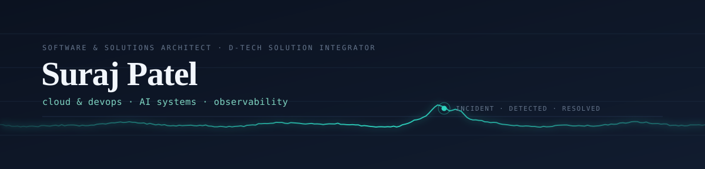

<picture>
  <source media="(prefers-color-scheme: dark)" srcset="assets/banner-dark.svg">
  <source media="(prefers-color-scheme: light)" srcset="assets/banner-light.svg">
  
</picture>

**Software & Solutions Architect** at D-Tech Solution Integrator, Bharuch — I build custom software for manufacturing plants, where a system going down means a production line stopping.

That shapes what I build outside work too: the pipeline that ships the code, the telemetry that tells you it broke, and the system that works out why.

**[LinkedIn](https://www.linkedin.com/in/suraj-patel-619480309/)** · **[sp9023156004@gmail.com](mailto:sp9023156004@gmail.com)** · Bharuch, Gujarat

---

## Selected work

### [Aegis](https://github.com/underratedgitter/Aegis) · an evidence-first AI SRE copilot
Watches a checkout-and-inventory service, spots abnormal behaviour, correlates related signals into a single incident, investigates it against real telemetry and runbooks, then proposes a **bounded** remediation — never an unreviewed one.

Runs fully offline: local fallback mode completes the whole detect → investigate → approve workflow deterministically, with no API key. Setting `OPENAI_API_KEY` swaps in a tool-calling investigator on top.

`Python` · observability · incident response · LLM tool-use

### [CI/CD Pipeline Automation](https://github.com/underratedgitter/CI-CD-Pipeline-Automation-with-Docker-Cloud-Deployment) · push to cloud in under five minutes
A containerised Node/Express API on a multi-stage Alpine image — non-root user, layer caching tuned for rebuild speed. Three-stage GitHub Actions pipeline: test → push to Docker Hub → deploy.

Prometheus scraping with Grafana dashboards and five alert rules that fire on the things that actually page you: latency, error rate, heap growth, event-loop lag.

`Docker` · `GitHub Actions` · `Prometheus` · `Grafana`

### [RAG Teaching Assistant](https://github.com/underratedgitter/RAG-teaching-assistant) · lecture video in, answers with timestamps out
Drop in a lecture recording, ask a question, get the answer *and* the exact moment it was said. Transcription feeds a vector index; queries return in under a second across 1,000+ chunks.

Batch chunking and parallel processing on CUDA took a run from **five minutes on CPU to twenty seconds on GPU**.

`PyTorch` · `CUDA` · vector search · speech-to-text

### [DevOps Lab](https://github.com/underratedgitter/devops-lab) · a working reference, not a bookmark folder
Practical labs, production-ready scripts and worked examples across the DevOps and SRE landscape — Linux and Bash up through Docker, Kubernetes, Helm, Terraform and the three major clouds.

Everything in it is tested before it lands, and documented well enough to be useful at 3am.

`Python` · `Bash` · `Kubernetes` · `Terraform`

---

## Toolkit

|  |  |
|---|---|
| **Cloud & DevOps** | Docker · GitHub Actions · Prometheus · Grafana · AWS · GCP · Oracle Cloud · Linux |
| **Languages** | Python · JavaScript · Node.js · C++ · C |
| **AI & acceleration** | PyTorch · CUDA · scikit-learn · pandas · NumPy |
| **Data & tooling** | MySQL · MongoDB · Redis · Git · Postman · Jest |

---

## Experience

**Software & Solutions Architect — D-Tech Solution Integrator, Bharuch** · current
Custom software for manufacturing plants across the Bharuch–Ankleshwar industrial belt. Systems that have to hold up on a shop floor, where downtime is counted in lost production rather than error rates.

**Cloud Event Manager — GDSC, P.P. Savani University** · Aug 2023 – Jan 2024
Ran 25+ hands-on cloud labs and 40+ coding sessions on GCP. Mentored a team of 12 through building and deploying eight applications. The programme helped the university reach **#1 in South Gujarat**.

**Data Analytics Simulation — Accenture North America** · Oct 2023
Cleaned and modelled seven datasets to shape social-media campaign strategy for a client brief.

**Open source — Bindu** · Feb 2026
Refactored Python exception handling for maintainability; wrote the API setup docs for OpenRouter and OpenAI models.

---

## Education & certifications

**B.Tech, Computer Science & Engineering** — P.P. Savani University, 2023–2027

AWS Cloud Foundations · IBM Machine Learning for Data Science · NPTEL Analytical Tools & Affective Computing · Saylor Business Intelligence & Analytics

---

Best reached by <a href="mailto:sp9023156004@gmail.com">email</a>.
